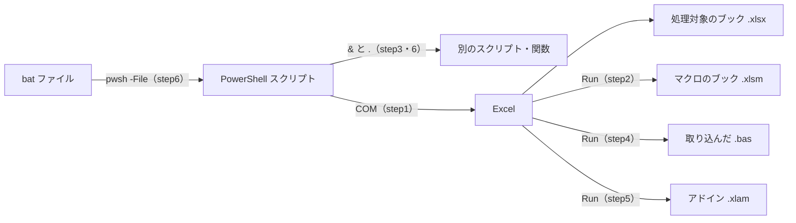

# PowerShell で Excel を操作する基本

PowerShell から Excel を動かすサンプル集です。セルの読み書きから始めて、VBA マクロの呼び出し、bat ファイルとの連携、エラーの扱いまでを 7 つの step で順に学びます。

各 step には見本のスクリプト（`stepN.ps1`）があります。この README の「打ち込むコード」を自分で入力して動かし、見本と比べながら進めてください。

## 全体像



| step | テーマ | 見本 | 使うもの |
|---|---|---|---|
| 1 | Excel の起動と終了、セルの読み書き | `step1.ps1` | |
| 2 | .xlsm のマクロを呼ぶ（引数、戻り値、配列） | `step2.ps1` | `macros.xlsm` |
| 3 | マクロを使わず、PowerShell の関数を別ファイルに分ける | `step3.ps1` | `excel-lib.ps1` |
| 4 | VBA を .bas（テキスト）で管理し、実行時に取り込む | `step4.ps1` | `vba\Module1.bas` |
| 5 | アドイン（.xlam）のマクロを呼ぶ | `step5.ps1` | `macros.xlam` |
| 6 | bat から ps を呼ぶ、ps から ps を呼ぶ、値を返す | `step6.ps1` `step6.bat` | `step6-sub.ps1` `step6-macro.ps1` |
| 7 | エラーが起きたときの扱い方 | `step7.ps1` `step7.bat` | `macros.xlsm` |

step1 が土台で、step2〜5 は「処理をどこに書くか」の選択肢です。新しく書くなら step3、すでにある VBA を使うなら step2・4・5 を選びます。step6 と step7 はどの方法とも組み合わせて使います。

## 準備

- **必要なもの**: Windows、Excel、PowerShell 7（`pwsh`）。
- **置き場所**: スクリプトは `E:\dev\excel` に置く前提で書かれています。

```text
git clone https://github.com/ZawaaDon/powershell-excel-basics.git E:\dev\excel
```

別の場所に置く場合は、各スクリプトの `E:\dev\excel` を置いた場所に書き換えてください。

- **元データ**: `sample-org.xlsx` の Sheet1 には、次の 5 行 5 列の表が入っています。スクリプトはこのファイルを書き換えず、毎回コピーしてから処理します。

| | A | B | C | D | E |
|---|---|---|---|---|---|
| 1 | a | ka | sa | ta | na |
| 2 | i | ki | si | ti | ni |
| 3 | u | ku | su | tu | nu |
| 4 | e | ke | se | te | ne |
| 5 | o | ko | so | to | no |

## 練習の進め方

1. 見本の `stepN.ps1` の冒頭コメント（学ぶこと、覚えておくこと）を読みます。
2. 同じフォルダに `my-stepN.ps1` を作り、下の「ひな形」に各 step の「打ち込むコード」を足して入力します。
3. PowerShell で `.\my-stepN.ps1` を実行し、「実行結果」と同じになるか確かめます。
4. 見本の `.\stepN.ps1` も実行して、結果とコードを比べます。

`my-` で始まるファイルは git の管理対象外にしてあるので、自由に作って構いません。練習用のスクリプトは `my-sample.xlsx` に書き込みます。

### ひな形

どの step でも使う「Excel を起動して、最後に必ず終了する」部分です。最初に `my-step1.ps1` として入力し、step2 以降はこのファイルをコピーして始めます。

```powershell
$srcPath = "E:\dev\excel\sample-org.xlsx"
$dstPath = "E:\dev\excel\my-sample.xlsx"
Copy-Item $srcPath $dstPath -Force -ErrorAction Stop

$excel = New-Object -ComObject Excel.Application
$excel.Visible = $false
$excel.DisplayAlerts = $false

try {
    $book  = $excel.Workbooks.Open($dstPath)
    $sheet = $book.Worksheets.Item("Sheet1")

    # ← ここに各 step のコードを書く

    $book.Save()
}
finally {
    if ($book)      { $book.Close($false) }
    if ($macroBook) { $macroBook.Close($false) }    # step2 以降で使う
    $excel.Quit()
    $sheet     = $null
    $book      = $null
    $macroBook = $null
    [void][System.Runtime.InteropServices.Marshal]::ReleaseComObject($excel)
    $excel = $null
    [GC]::Collect()
    [GC]::WaitForPendingFinalizers()
}
```

このまま実行すると何も表示されず、`my-sample.xlsx` ができます。実行後に `Get-Process excel` で何も出なければ、Excel は正しく終了しています。

`finally` の中は、エラーで止まっても必ず実行されます。ここを省くと、見えない Excel がプロセスとして残り続けます。

## Step 1 : セルの読み書き

**学ぶこと**: セルを読む、行を順にたどる、セルに書く。

ひな形の「ここに各 step のコードを書く」の位置に入力します。

```powershell
    # 読む
    Write-Host "A1 = $($sheet.Range('A1').Value2)"

    # A列を上から最終行まで読む
    $xlUp    = -4162
    $lastRow = $sheet.Cells.Item($sheet.Rows.Count, 1).End($xlUp).Row
    for ($r = 1; $r -le $lastRow; $r++) {
        Write-Host $sheet.Cells.Item($r, 1).Value2
    }

    # 書く（表の外の G 列）
    $sheet.Range("G1").Value2    = "練習"
    $sheet.Range("G1").Font.Bold = $true
```

実行結果:

```text
A1 = a
a
i
u
e
o
```

`my-sample.xlsx` を開くと、G1 に太字で「練習」と入っています。

**つまずきやすい点**

- 行、列、シートの番号はすべて 1 から始まります。
- VBA の定数名（`xlUp` など）は使えないので、数値（`-4162`）で指定します。
- プロパティ名を間違えて読むと、エラーにならず `$null` が返ります。

**試してみる**: B列を読むように変える。G2 に数式 `=SUM(1,2,3)` を書く（`.Formula` を使う）。

## Step 2 : .xlsm のマクロを呼ぶ

**学ぶこと**: `$excel.Run("'ブック名'!マクロ名", 引数...)` でマクロを呼ぶ。

`macros.xlsm` には次のマクロが入っています（中身は `macros.txt` で読めます）。

| マクロ | 内容 |
|---|---|
| `BoldHeader()` | アクティブなシートの 1 行目を太字にする |
| `WriteText(addr, text)` | 指定セルに文字を書く |
| `AddTwo(a, b)` | 2 つの数を足して返す |
| `SumArray(values)` | 配列の中身をすべて足して返す |

`my-step1.ps1` をコピーして `my-step2.ps1` を作り、Step 1 で書いた部分を次のコードに入れ替えます。

```powershell
    # マクロのブックも、同じ Excel で開く
    $macroBook = $excel.Workbooks.Open("E:\dev\excel\macros.xlsm", 0, $true)

    # マクロは「いま選ばれているシート」に対して動くので、対象を選んでおく
    $book.Activate()
    $sheet.Activate()

    $excel.Run("'macros.xlsm'!BoldHeader")                      # 引数なし
    $excel.Run("'macros.xlsm'!WriteText", "G1", "マクロから")    # 引数あり
    $sum = $excel.Run("'macros.xlsm'!AddTwo", 3, 4)             # 戻り値あり
    Write-Host "AddTwo = $sum"
    $total = $excel.Run("'macros.xlsm'!SumArray", @(1, 2, 3))   # 配列を渡す
    Write-Host "SumArray = $total"
```

実行結果:

```text
AddTwo = 7
SumArray = 6
```

### 呼び出しを短く書く

毎回 `$excel.Run("'macros.xlsm'!...")` と書くのは長いので、関数にまとめます。次の関数を `try` の前に足します。

```powershell
function Invoke-Macro {
    $target    = "'$($macroBook.Name)'!$($args[0])"
    $macroArgs = @()
    if ($args.Count -gt 1) { $macroArgs = $args[1..($args.Count - 1)] }
    $excel.GetType().InvokeMember('Run', 'InvokeMethod', $null, $excel, @($target) + $macroArgs)
}
```

そして、先ほどのコードの下に次を足します。

```powershell
    $sum2 = Invoke-Macro AddTwo 5 6
    Write-Host "AddTwo = $sum2"
```

`AddTwo = 11` が増えれば成功です。

**つまずきやすい点**

- 呼び出し名はファイル名で書きます（フルパスではありません）。
- 呼べるのは、標準モジュールに書いた Public な Sub と Function だけです。
- マクロに `MsgBox` があると、画面が非表示のまま待ち続けて止まります。

**試してみる**: `Invoke-Macro` で `WriteText` を呼んで G2 に文字を書く。`SumArray` に渡す配列を変える。

## Step 3 : PowerShell の関数を別ファイルに分ける

**学ぶこと**: 共通の処理を関数にして別ファイルに置き、`. ファイル` で読み込む。マクロのブックは使いません。

`my-step1.ps1` をコピーして `my-step3.ps1` を作ります。まず、ファイルの先頭に次の 1 行を足します。

```powershell
. "$PSScriptRoot\excel-lib.ps1"
```

次に、Step 1 で書いた部分を次のコードに入れ替えます。

```powershell
    Set-BoldHeader $sheet
    Write-CellText $sheet "G1" "関数から"
    $sum = Add-Two 3 4
    Write-Host "Add-Two = $sum"
```

実行結果:

```text
Add-Two = 7
```

**つまずきやすい点**

- 関数の呼び出しは、カッコとカンマを使わず空白で区切ります。`Add-Two(3, 4)` と書くと「配列 1 個を渡した」ことになり、7 になりません。
- `$PSScriptRoot` は、実行中のスクリプトがあるフォルダです。

**試してみる**: `excel-lib.ps1` を読み、同じ書き方で「指定セルを黄色にする関数」を `my-lib.ps1` に書いて呼ぶ（`$sheet.Range($addr).Interior.ColorIndex = 6`）。

## Step 4 : VBA を .bas で管理して取り込む

**学ぶこと**: VBA のコードをテキスト（`vba\Module1.bas`）で持ち、実行時に一時ブックへ取り込んで呼ぶ。

**事前の設定（必須）**: Excel のオプション → トラスト センター → トラスト センターの設定 → マクロの設定 で、「VBA プロジェクト オブジェクト モデルへのアクセスを信頼する」をオンにします。セキュリティを下げる設定なので、使わなくなったらオフに戻してください。

`my-step1.ps1` をコピーして `my-step4.ps1` を作り、Step 1 で書いた部分を次のコードに入れ替えます。

```powershell
    # 一時ブックを作り、.bas を取り込む（保存しないので .xlsm は作られない）
    $macroBook = $excel.Workbooks.Add()
    $macroBook.VBProject.VBComponents.Import("E:\dev\excel\vba\Module1.bas") | Out-Null
    $macroName = "'" + $macroBook.Name + "'!"       # 一時ブックの名前は実行時に決まる

    $book.Activate()
    $sheet.Activate()

    $sum = $excel.Run($macroName + "AddTwo", 3, 4)
    Write-Host "AddTwo = $sum"
```

実行結果:

```text
AddTwo = 7
```

**つまずきやすい点**

- 事前の設定がオフだと、`VBProject` が `$null` になり「null に対してメソッドを呼べない」で止まります。
- .bas の改行は CRLF にします。1 行目の `Attribute VB_Name = "Module1"` は消しません。

**試してみる**: `vba\Module1.bas` に自分の Function を 1 つ足して呼ぶ。

## Step 5 : アドイン（.xlam）のマクロを呼ぶ

**学ぶこと**: アドインを自分で開いてから、Step 2 と同じ書き方で呼ぶ。

`my-step1.ps1` をコピーして `my-step5.ps1` を作り、Step 1 で書いた部分を次のコードに入れ替えます。

```powershell
    # アドインは自動では読み込まれないので、自分で開く
    $macroBook = $excel.Workbooks.Open("E:\dev\excel\macros.xlam")

    $book.Activate()
    $sheet.Activate()

    $excel.Run("'macros.xlam'!WriteText", "G1", "アドインから")
    $sum = $excel.Run("'macros.xlam'!AddTwo", 3, 4)
    Write-Host "AddTwo = $sum"
```

実行結果:

```text
AddTwo = 7
```

**つまずきやすい点**

- PowerShell から起動した Excel は、Excel に登録してあるアドインを自動では読み込みません。
- アドインは非表示のブックで、`$excel.Workbooks` の一覧に出ません。`Open()` の戻り値を変数に取っておきます。
- ファイルの場所は UNC パス（`\\サーバー名\共有名\...`）でも指定できます。呼び出し名はファイル名だけのままです。

**試してみる**: `$excel.AddIns` を `foreach` で回し、登録済みアドインの `Name` と `FullName` を表示する。

## Step 6 : スクリプトから別のスクリプトを呼ぶ

**学ぶこと**: 引数を受け取るスクリプトを書き、ps と bat の両方から呼んで、値を受け取る。

この step は Excel を使わずに練習します（見本の `step6-sub.ps1` は Excel に書き込みます）。

まず、呼ばれる側を `my-sub.ps1` として入力します。

```powershell
param(
    [string]$Name = "名無し",
    [int]$Count = 1
)
$ErrorActionPreference = "Stop"

"$Name さんに $Count 回あいさつしました"
```

次に、ps から呼ぶ側を `my-step6.ps1` として入力します。

```powershell
& "$PSScriptRoot\my-sub.ps1"                            # 引数なし
& "$PSScriptRoot\my-sub.ps1" "太郎" 3                    # 引数あり（順番で渡す）
& "$PSScriptRoot\my-sub.ps1" -Count 2 -Name "花子"       # 引数あり（名前で渡す）

$result = & "$PSScriptRoot\my-sub.ps1" "次郎" 5          # 戻り値を受け取る
Write-Host "戻り値 = $result"
```

実行結果:

```text
名無し さんに 1 回あいさつしました
太郎 さんに 3 回あいさつしました
花子 さんに 2 回あいさつしました
戻り値 = 次郎 さんに 5 回あいさつしました
```

最後に、bat から呼ぶ側を `my-step6.bat` として入力します。bat の中には日本語を書かないでください（文字コードによって化けます）。

```bat
@echo off
pwsh -NoProfile -ExecutionPolicy Bypass -File "%~dp0my-sub.ps1" Taro 3
echo exit code = %ERRORLEVEL%

set RESULT=
for /f "usebackq delims=" %%A in (`pwsh -NoProfile -ExecutionPolicy Bypass -File "%~dp0my-sub.ps1" Hanako 2`) do set RESULT=%%A
echo result = %RESULT%

pause
```

`my-step6.bat` をダブルクリックして実行します。実行結果:

```text
Taro さんに 3 回あいさつしました
exit code = 0
result = Hanako さんに 2 回あいさつしました
```

**つまずきやすい点**

- `param(...)` はファイルの先頭に書きます。上に置けるのはコメントだけです。
- `%~dp0` は bat ファイル自身があるフォルダです。
- `for /f` は、スクリプトが画面に出したものをすべて受け取ります。値を返すスクリプトでは、返したい 1 行のほかは出力しません。
- そのまま出力した値が戻り値になります。`Write-Host` の表示は戻り値に入りません。

**試してみる**: `step6.bat` を実行し、`step6-macro.ps1` がマクロで計算した値（21.5）を bat が受け取る流れを読む。

## Step 7 : エラーが起きたときの扱い方

**学ぶこと**: エラーを `try` / `catch` で受ける。計算できない値を見分ける。失敗を呼び出し元に伝える。

`my-step1.ps1` をコピーして `my-step7.ps1` を作り、Step 1 で書いた部分を次のコードに入れ替えます。

```powershell
    $macroBook = $excel.Workbooks.Open("E:\dev\excel\macros.xlsm", 0, $true)

    # 1. PowerShell 側のエラーを受ける
    try {
        $excel.Workbooks.Open("E:\dev\excel\nothing.xlsx")
    }
    catch {
        Write-Host "開けませんでした"
    }

    # 2. マクロ側でエラーを処理し、結果を戻り値で受け取る
    foreach ($x in 9, -1) {
        $result = $excel.Run("'macros.xlsm'!SafeCalc", "sqrt", $x)
        if ($result -is [string]) {
            Write-Host "sqrt($x) : 計算できません"
        }
        else {
            Write-Host "sqrt($x) = $result"
        }
    }

    # 3. PowerShell の計算はエラーにならないので、自分で確かめる
    $v = [math]::Sqrt(-1)
    if ([double]::IsNaN($v)) {
        Write-Host "Sqrt(-1) : 計算できません（$v）"
    }
```

実行結果:

```text
開けませんでした
sqrt(9) = 3
sqrt(-1) : 計算できません
Sqrt(-1) : 計算できません（NaN）
```

**つまずきやすい点**

- PowerShell は、エラーが起きてもメッセージを出して次の行へ進むことが多く、最後まで進むと終了コードは 0（成功）になります。先頭に `$ErrorActionPreference = "Stop"` を書くと、エラーの行で止まります。
- マクロの中で起きたエラーは、PowerShell の `try` / `catch` では受けられません。Excel がエラーのダイアログを出して待ち続けます。マクロ側で `On Error` を書き、戻り値でエラーを知らせます（`macros.txt` の `SafeCalc` を参照）。
- Excel が異常終了すると、その後の呼び出しはすべてエラーになります。`Quit()` も失敗するので、後始末にも `try` / `catch` が要ります。

**試してみる**: `SafeCalc` の第 1 引数を `"log"` `"acos"` `"exp"` `"div"` に変え、どの値で計算できなくなるか確かめる。続けて見本の `.\step7.ps1` を実行し、時間切れと異常終了の扱い（4 と 5）を読む。実行には 10 秒ほどかかります。

## ファイル一覧

| ファイル | 内容 |
|---|---|
| `step1.ps1`〜`step7.ps1` | 各 step の見本 |
| `step6.bat` `step7.bat` | bat から呼ぶ見本 |
| `step6-sub.ps1` `step6-macro.ps1` | step6 で呼ばれる側のスクリプト |
| `excel-lib.ps1` | step3 の共通関数 |
| `sample-org.xlsx` | 元データ（書き換えない） |
| `macros.xlsm` `macros.xlam` | マクロのブックとアドイン |
| `macros.txt` `vba\Module1.bas` | マクロの中身（読む用と、step4 で取り込む用） |
| `sample-stepN.xlsx` `my-*` | 実行時にできる作業用ファイル（git の管理対象外） |

## 困ったとき

- **Excel が残った**: `Get-Process excel` で確認し、`Stop-Process -Id 番号` で終了します。自分で開いている Excel まで閉じないよう、番号を指定してください。
- **スクリプトが止まったまま戻らない**: 見えない Excel がダイアログを出して待っています。ひな形の `$excel.Visible = $false` を `$true` にすると、何が出ているか見えます。
- **「このシステムではスクリプトの実行が無効」と出る**: `pwsh -ExecutionPolicy Bypass -File .\my-step1.ps1` で実行します。
- **日本語が化ける**: Windows 標準の PowerShell 5.1（`powershell`）ではなく、PowerShell 7（`pwsh`）で実行してください。
